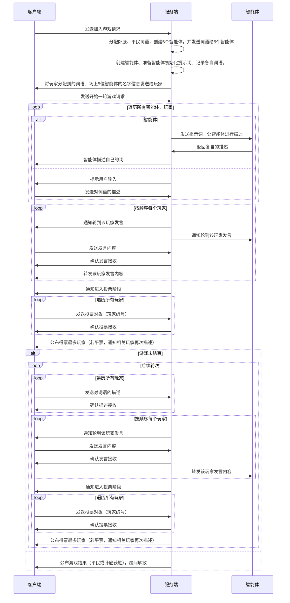

# 谁是卧底

## 需求

睿睿想玩谁是卧底总是凑不齐人， 我想帮她开发一个在家里能玩的，AI玩的自闭环的，鲁棒性好一点的，《谁是卧底》游戏机器人。 计划用Deepseek 部署在LMStudio + LMStudio的API，可以实现调用对话。然后可以写一个服务器端来驱动规则，我们几个人都可以玩。还需要寻找一个开源方案的配音AI来根据文本合成语音，扮演不同的机器人，每个机器人分配一个独特的嗓音。 服务端采用nodejs开发，为人类提供一个网页页面来为人类玩家分配各自的题目词，每个人独自看自己的界面，机器人不需要界面。


方案2: 用deepseek R1 本地部署 + CosyVoice 本地部署。


## LM Studio接入

开启server
LM Studio默认可能是4096tokens，要手动改高一点，deepseek-r1-distill-qwen-7b 可以最大128K。


```
curl http://192.168.50.8:1234/api/v0/chat/completions \
  -H "Content-Type: application/json" \
  -d '{
    "model": "deepseek-r1-distill-qwen-7b",
    "messages": [
      { "role": "system", "content": "Always answer in rhymes." },
      { "role": "user", "content": "Introduce yourself." }
    ],
    "temperature": 0.7,
    "max_tokens": -1,
    "stream": false
  }'

```

# 服务流程：




