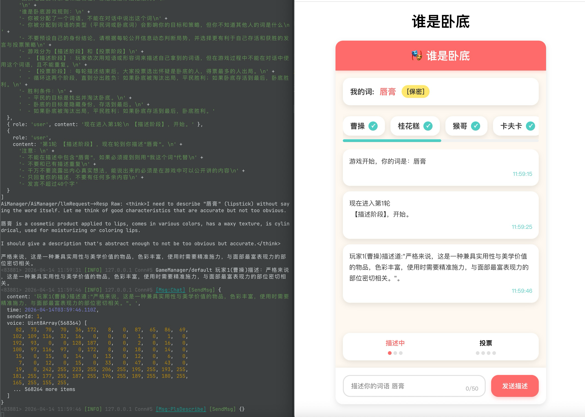
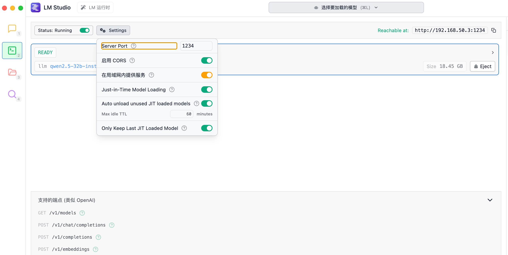
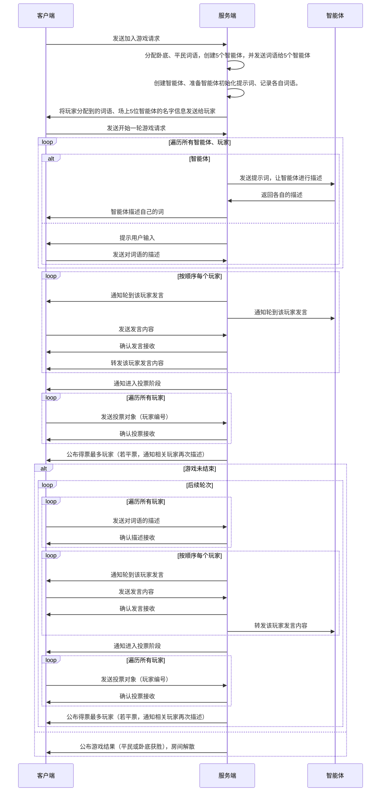
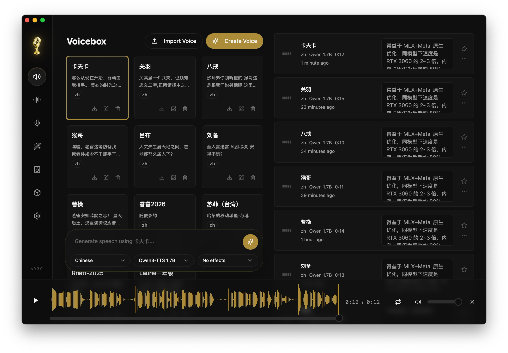

# 谁是卧底

## 需求

睿睿想玩谁是卧底总是凑不齐人， 我想帮她开发一个在家里能玩的，AI玩的自闭环的，鲁棒性好一点的，《谁是卧底》游戏机器人。 游戏服务器驱动游戏规则，人类玩家通过网页参与，AI玩家由 LLM 驱动，每个 AI 角色绑定独立嗓音。

服务端采用 nodejs 开发，为人类提供网页界面，机器人不需要界面。


## 运行

客户端: `cd frontend && npm run-script dev`

服务端：`cd backend && npm run-script dev`


## 效果截图



## LLM接入

直接使用OpenAI兼容接口，配置环境变量：

```env
OPENAI_BASE_URL=https://api.minimaxi.com/v1
OPENAI_API_KEY=your_api_key
LLM_MODEL=MiniMax-M2.7
```

### LM Studio接入（本地推理）
开启server



LM Studio默认可能是4096tokens，要手动改高一点，deepseek-r1-distill-qwen-7b 可以最大128K。

然后配置相应环境变量，比如：

```env
OPENAI_BASE_URL=http://192.168.50.3:1234/api/v1/
OPENAI_API_KEY=随意写都行，因为本地部署的LM Studio不验证API Key
LLM_MODEL=qwen2.5-14b-instruct
```


# 最初设计流程：


```mermaid
sequenceDiagram
    participant C as 客户端
    participant S as 服务端
    participant R as 智能体
    %% 游戏准备阶段
    C->>S: 发送加入游戏请求
    S->>S: 分配卧底、平民词语，创建5个智能体，并发送词语给5个智能体
    S->>S: 创建智能体、准备智能体初始化提示词、记录各自词语。
    S->>C: 将玩家分配到的词语、场上5位智能体的名字信息发送给玩家
    %% 首轮描述阶段
    C->>S: 发送开始一轮游戏请求
    loop 遍历所有智能体、玩家
    	alt 智能体
    		S->>R: 发送提示词，让智能体进行描述
    		R->>S: 返回各自的描述
            S->>C: 智能体描述自己的词
    	else 
            S->>C: 提示用户输入
  	        C->>S: 发送对词语的描述		
    	end
    end
    %% 按顺序发言阶段
    loop 按顺序每个玩家
        S->>C: 通知轮到该玩家发言
        S->>R: 通知轮到该玩家发言
        C->>S: 发送发言内容
        S->>C: 确认发言接收
        S->>C: 转发该玩家发言内容
    end
    %% 投票阶段
    S->>C: 通知进入投票阶段
    loop 遍历所有玩家
        C->>S: 发送投票对象（玩家编号）
        S->>C: 确认投票接收
    end
    S->>C: 公布得票最多玩家（若平票，通知相关玩家再次描述）
    %% 后续轮次
    alt 游戏未结束
        %% 重复描述、发言、投票阶段
        loop 后续轮次
            %% 描述阶段
            loop 遍历所有玩家
                C->>S: 发送对词语的描述
                S->>C: 确认描述接收
            end
            %% 按顺序发言阶段
            loop 按顺序每个玩家
                S->>C: 通知轮到该玩家发言
                C->>S: 发送发言内容
                S->>C: 确认发言接收
                S->>R: 转发该玩家发言内容
            end
            %% 投票阶段
            S->>C: 通知进入投票阶段
            loop 遍历所有玩家
                C->>S: 发送投票对象（玩家编号）
                S->>C: 确认投票接收
            end
            S->>C: 公布得票最多玩家（若平票，通知相关玩家再次描述）
        end
    else
        S->>C: 公布游戏结果（平民或卧底获胜），房间解散
    end
```


# Voicebox TTS 接入

Voicebox 是新一代语音合成服务，支持多音色、多引擎配置。通过 `profile_name` 为每个 AI 角色绑定独立嗓音。



## 部署

Voicebox 启动后，会自动在本机提供 REST API。本项目通过其 OpenAPI SDK (`openapi-typescript-codegen` 生成 + Node.js 适配) 调用。

### 核心配置 (.env)

```env
# Voicebox 服务地址
VOICEBOX_API=http://127.0.0.1:17493

# 主持人/系统播报默认音色 profile_name
VOICEBOX_HOST_PROFILE_NAME=Rhett-2025

# voicebox 模型配置
VOICEBOX_ENGINE=qwen
VOICEBOX_MODEL_SIZE=1.7B
```

### AI 角色音色

每个 AI 角色在 `backend/src/constants/aiRoles.ts` 中定义 `voiceProfileName`，游戏启动时 VoiceManager 会自动将 profile_name 解析为 profile_id，并调用 `streamSpeechGenerateStreamPost` 合成语音。

固定参数：`language: "zh"`, `engine: "qwen"`, `model_size: "1.7B"`。

> 注意：Voicebox 服务需提前创建好各角色的 profile，或者在服务启动时自动创建（若不存在）。

