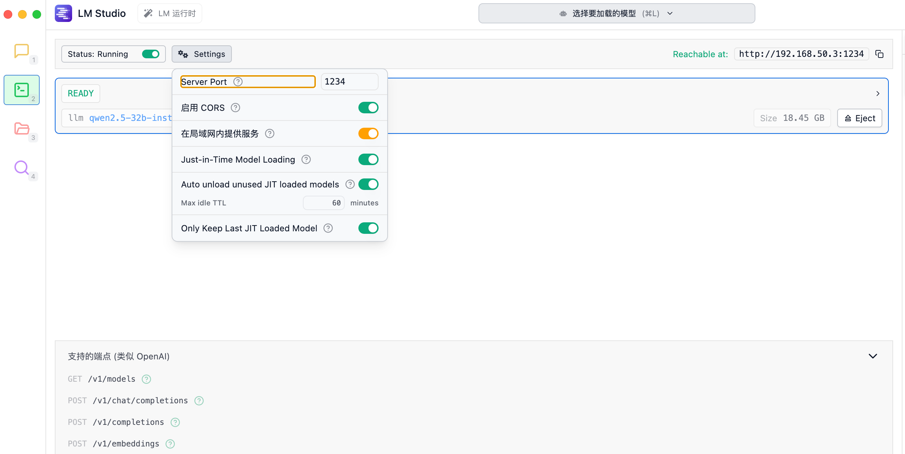

# 谁是卧底

## 需求

睿睿想玩谁是卧底总是凑不齐人， 我想帮她开发一个在家里能玩的，AI玩的自闭环的，鲁棒性好一点的，《谁是卧底》游戏机器人。 计划用Deepseek 部署在LMStudio + LMStudio的API，可以实现调用对话。然后可以写一个服务器端来驱动规则，我们几个人都可以玩。还需要寻找一个开源方案的配音AI来根据文本合成语音，扮演不同的机器人，每个机器人分配一个独特的嗓音。 服务端采用nodejs开发，为人类提供一个网页页面来为人类玩家分配各自的题目词，每个人独自看自己的界面，机器人不需要界面。

方案2: 用deepseek R1 本地部署 + CosyVoice 本地部署。

后来发现R1思维模式不适合本地部署玩这游戏，因为它每次输出tokens太多了，会需要等待更久。

## LM Studio接入

开启server

LM Studio默认可能是4096tokens，要手动改高一点，deepseek-r1-distill-qwen-7b 可以最大128K。

# 服务流程：

# CosyVoice接入
CosyVoice 是一个开源的语音合成工具，它可以根据文本生成高质量的语音。它支持多种语言和风格，并且可以根据用户的需求进行自定义。CosyVoice 可以在 Windows、Linux 和 macOS 上运行。
按照官方文档部署到conda环境。
然后把restapi.py放到cosyvoice目录下，然后安装库`pip install Flask`，
运行`python restapi.py`。

# 运行

本地运行LMStudio，下载好模型，开启开发者服务器。

客户端: `cd frontend && npm run-script dev`

服务端：`cd backend && npm run-script dev`

